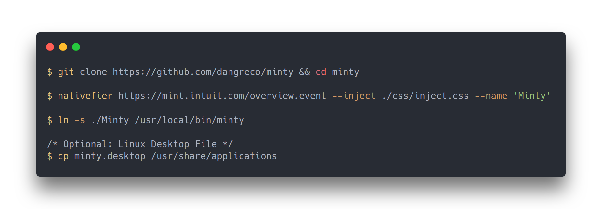

<p align="center">

<br />
<br />
<b>Cross-platform Mint desktop experience. Ad-free, modern design.</b>
</p>


# Status: Experimental
Right now, there's a lot of missing CSS. In addition, there is a bug in which browser cookies are not persisted.


# Installation

Make sure that ```node```, ```git```, and ```nativefier``` are installed. Then:



<br />
<br />

# FAQ

### Q: Will there be a light mode?
A: No.

### Q: I want to contribute to this repo, how do I do that?
A: Submit a pull request containing your desired commits.

### Q: Why is there no license?
A: I'm not really sure if adding a license to this repo will be infringing on any copyright laws, that's why.
